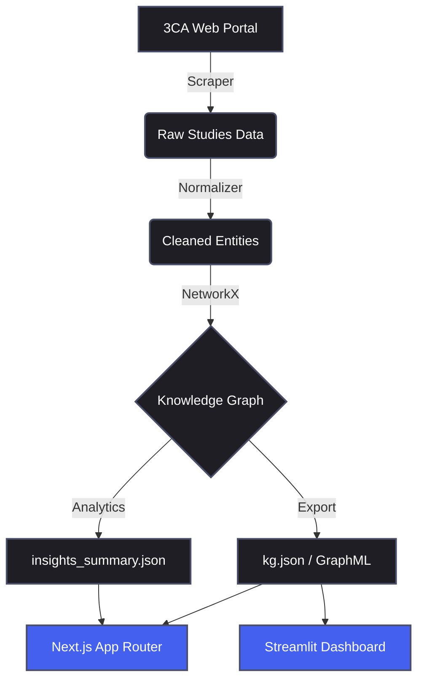
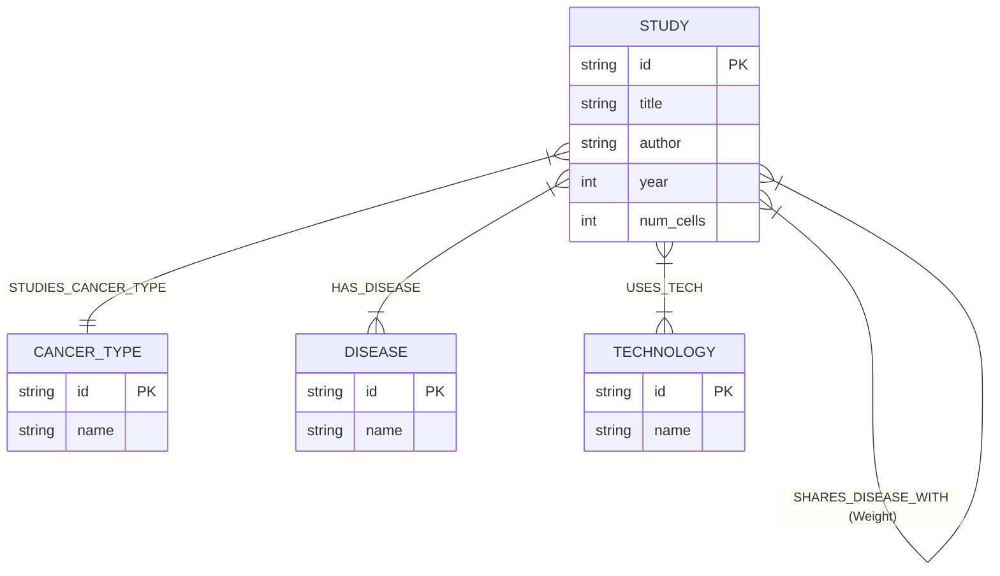
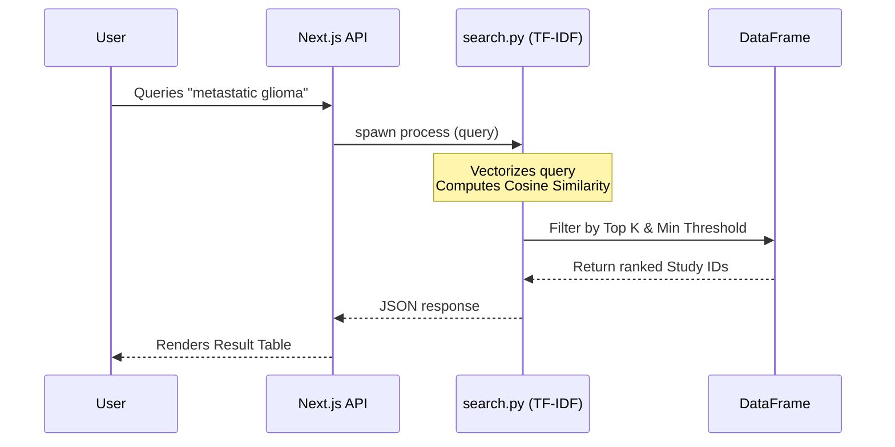

# 3CA Knowledge Graph: Bridging Single-Cell Atlases

   

This project provides a comprehensive data ingestion, knowledge graph construction, and search pipeline for the **Curated Cancer Cell Atlas (3CA)**. By scraping dataset metadata across 15 cancer types and linking studies together based on shared traits, this tool surfaces hidden cross-organ biological relationships via an offline-first semantic search engine and an interactive network visualization dashboard.

---

## 🌟 Key Features

1. **Heterogeneous Knowledge Graph**: Links siloed cancer studies together by disease, cancer type, and sequencing technology.
2. **Cross-Cancer Insights Engine**: Automatically detects studies from entirely different anatomical cancer types that share identical disease meta-programs.
3. **TF-IDF Semantic Search**: Offline, deterministic search engine querying across study metadata without reliance on external LLM API costs.
4. **Dual Frontend Interfaces**:
   - **Internal Streamlit App**: Built for rapid data exploration and raw graph physics.
   - **Public Next.js Dashboard**: A polished, dark-mode Vercel-ready frontend showcasing the insights.

---

## 🏗 System Architecture

The pipeline is split into distinct sequential stages: Extraction, Normalization, Graph Construction, Analytics, and Presentation.



---

## 🧬 Data Model (Ontology)

The core data structure is modeled as a heterogeneous property graph. Rather than modeling raw gene expression matrices (which is highly compute-intensive), the graph maps **Study-level metadata** as a lightweight index for biological discovery.



### The `SHARES_DISEASE_WITH` Edge
A key derived edge is inferred between two `Study` nodes if they fall under different `CancerType` umbrellas but share identical `Disease` labels. This algorithmically surfaces hidden cross-organ biological connections (e.g., detecting shared malignant states between Melanoma and Glioblastoma).

---

## 🔍 Offline Search Engine Workflow

The project avoids expensive per-request LLM calls by leveraging a customized Term Frequency-Inverse Document Frequency (TF-IDF) engine coupled with cosine similarity.



---

## 📸 Dashboard Walkthrough

### 1. Data Exploration & Cross-Cancer Insights
The Explore tab offers complex filtering across technologies, minimum cell counts, and cancer types. The Insights panel automatically extracts the highest-weighted cross-dataset biological links.


> *The Next.js Explore tab featuring distribution metrics and data grids.*

### 2. Interactive Network Graph
The Graph tab renders the NetworkX topology via a physics-based 2D force simulation. Nodes are dynamically sized based on their mathematical Degree Centrality within the network.


> *The interactive Knowledge Graph rendering Study, Cancer, and Disease nodes.*

---

## 📊 Analytics & Insights Summary

The Python analytics pipeline pre-computes several complex graph metrics exported as static JSON to power the dashboard:

| Metric | Description |
|---|---|
| **Degree Centrality** | Ranks the top 10 most highly-connected foundational studies. |
| **Connected Components** | Discovers isolated "islands" of cancer research versus the giant connected component. |
| **Co-occurrence Matrix** | Maps the adoption of technologies (10x vs SmartSeq2) across different disease vectors. |
| **Cross-Links** | Identifies studies sharing meta-programs across distinct physiological boundaries. |

---

## ⚙️ Key Design Decisions & Trade-offs

1. **TF-IDF over Dense Embeddings**: Semantic search is implemented via Scikit-Learn TF-IDF offline instead of hitting an external embeddings API (like OpenAI). This requires zero infrastructure, costs nothing per request, and is deterministic.
2. **NetworkX over Graph DB**: We use in-memory Python dictionaries and NetworkX instead of a standalone database like Neo4j. This allows for a zero-configuration local deployment.
3. **Study-Level Granularity**: Processing raw single-cell RNA (scRNA) matrices requires massive compute. Mapping the study-level metadata serves as a lightweight, powerful index to navigate the atlas before downloading payload data.

---

## 🚀 How to Run Locally

### 1. Clone & Setup Python Environment
```bash
git clone https://github.com/Vilsee/-3ca-knowledge-graph-.git
cd -3ca-knowledge-graph-
python -m venv .venv

# Activate (Windows)
.\.venv\Scripts\activate
# Activate (Mac/Linux)
source .venv/bin/activate

pip install -r requirements.txt
```

### 2. Run the Data Pipeline
Execute the Python scripts in sequence to build the graph and analytics:
```bash
python scraper/fetch_studies.py
python graph/normalize.py
python graph/build_graph.py
python analysis/insights.py
```

### 3. Launch the Dashboards

**To run the Next.js Public Dashboard:**
```bash
cd site
npm install
npm run dev
```
Navigate to [http://localhost:3001](http://localhost:3001).

**To run the Streamlit Internal Dashboard:**
```bash
# From the root directory
streamlit run app/dashboard.py
```
Navigate to [http://localhost:8501](http://localhost:8501).

---

*This project was submitted as a technical showcase for rapid metadata integration and semantic network visualization.*
