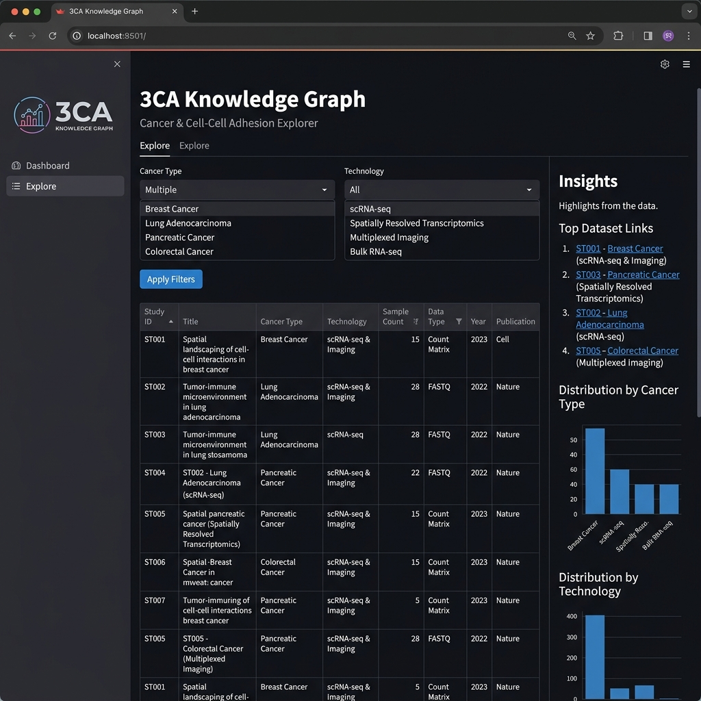
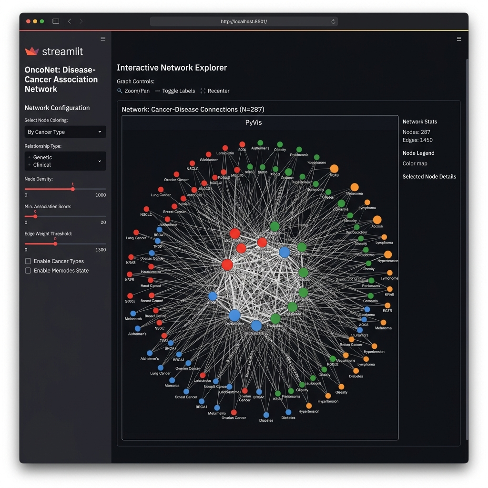

# 3CA Knowledge Graph

This project provides a complete data ingestion, knowledge graph construction, and search pipeline for the Curated Cancer Cell Atlas (3CA). It scrapes dataset metadata across 15 cancer types, links studies together to form an interconnected heterogeneous graph based on shared traits, and surfaces insights and relationships via an interactive offline Streamlit dashboard.

## Data Model

The knowledge graph models the ecosystem using four distinct node types and relational edges:
- **Study**: The core entity, storing attributes like title, author, year, cell count, and data completeness.
- **CancerType**: Broad organ/cancer groupings (e.g., lung, breast). Connected to Studies via `STUDIES_CANCER_TYPE` edges.
- **Disease**: Specific sub-disease labels (e.g., Lung Adenocarcinoma). Connected to Studies via `HAS_DISEASE` edges.
- **Technology**: Sequencing platform (e.g., 10x, SmartSeq2). Connected to Studies via `USES_TECH` edges.

A key derived edge, **`SHARES_DISEASE_WITH`**, is inferred between two Studies if they fall under different `CancerType` umbrellas but share identical `Disease` labels. This surfaces hidden cross-organ biological connections. 

## Scope Justification

This project focuses entirely on study-level metadata rather than raw single-cell RNA (scRNA) matrices. Processing and normalizing raw expression data for millions of cells requires massive compute, distributed storage, and significant alignment time. Mapping the study-level metadata serves as a lightweight, powerful index to navigate the atlas without the overhead of processing raw expression payloads.

## Key Design Decisions

- **TF-IDF over Embeddings**: Semantic search is implemented via TF-IDF offline instead of hitting an external embeddings API. This requires zero API cost, is fully deterministic, and builds instantly.
- **NetworkX over Graph DB**: We use in-memory NetworkX instead of a standalone database like Neo4j. This allows for a zero-infrastructure local deployment while generating a `GraphML` export for seamless future database migration.
- **Minimal LLM Dependency**: We avoid per-request LLM calls to keep the dashboard snappy and offline-first.

## Trade-offs & Limitations

- Disease labels are currently free text scraped directly from the site and can be noisy without a dedicated normalization step.
- The `SHARES_DISEASE_WITH` edge is only a surface-level proxy for real biological similarity. A robust biological metric would use actual cell meta-program gene sets.
- Auth and infrastructure scaling are out of scope for this localized prototype.

## Future Extensions

If granted more time, the system can be expanded by:
1. **True Biological Similarity**: Scraping per-study meta-program gene lists to build authentic similarity edges instead of relying on a disease-label proxy.
2. **Citation Networks**: Pulling PubMed metadata via the paper DOIs to generate citation-network edges between studies.
3. **Deep Embeddings**: Swapping TF-IDF for dense vector embeddings once full abstract/summary text is scraped.
4. **Graph DB Migration**: Pushing the full NetworkX topology into a hosted Neo4j instance for proper Cypher querying at scale.

## Dashboard Screenshots


*The Explore Tab featuring data filters, metrics, and cross-dataset insights.*


*The interactive Knowledge Graph rendering Study, Cancer, and Disease nodes.*

## How to Run

Clone the repository and set up your virtual environment:

```bash
git clone https://github.com/Vilsee/-3ca-knowledge-graph-.git
cd -3ca-knowledge-graph-
python -m venv .venv

# Activate venv (Windows)
.\.venv\Scripts\activate
# Activate venv (Mac/Linux)
source .venv/bin/activate

pip install -r requirements.txt
```

Run the pipeline from end-to-end:
```bash
python scraper/fetch_studies.py
python graph/normalize.py
python graph/build_graph.py
python analysis/insights.py
```

Launch the interactive Dashboard:
```bash
streamlit run app/dashboard.py
```
